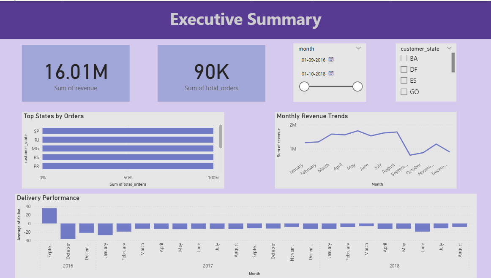
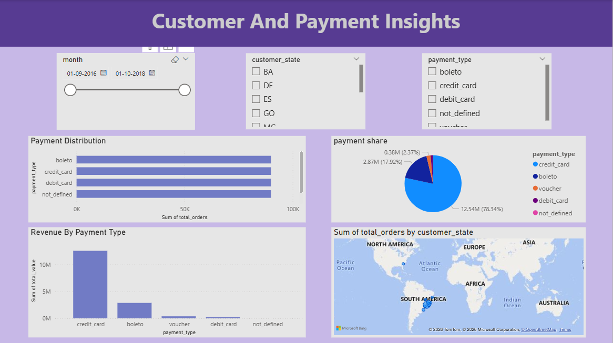
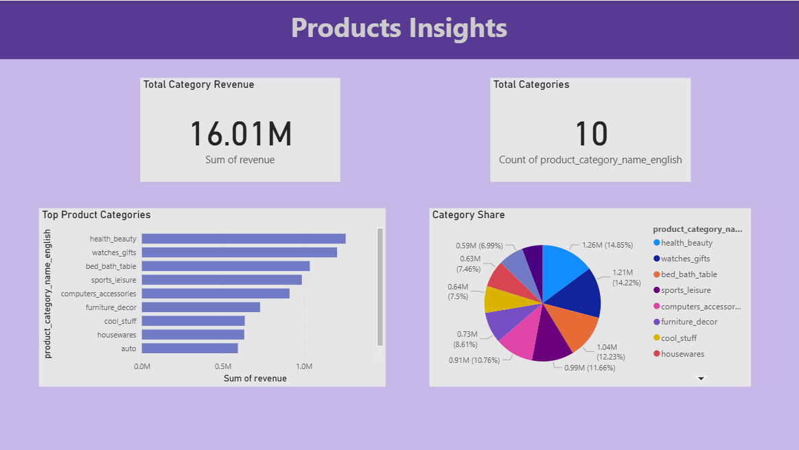

# E-Commerce Sales & Customer Analytics Project

## 📊 Overview

This project analyzes a large-scale Brazilian E-commerce dataset to derive business insights related to sales, customer behavior, payment patterns, and delivery performance.

## 🛠 Tools & Technologies

* Python (Pandas, NumPy, Matplotlib)
* MySQL
* Power BI
## Dataset

The dataset used in this project is the Brazilian E-Commerce Public Dataset by Olist available on Kaggle:

https://www.kaggle.com/datasets/olistbr/brazilian-ecommerce

The dataset contains information about:

- Orders
- Customers
- Products
- Payments
- Reviews
- Sellers
- Geolocation

It includes approximately 100k+ ecommerce order records across multiple interconnected tables.

## 🔄 Project Workflow

1. Data Understanding (Exploratory Data Analysis)
2. Data Cleaning & Feature Engineering
3. SQL-Based Business Analysis
4. Power BI Dashboard Visualization

## 📈 Key Insights

* Revenue shows a consistent upward trend over time.
* A few states contribute the majority of total orders.
* Credit card is the most preferred payment method.
* Most orders contain a single product.
* Delivery delays negatively impact customer satisfaction.

## 📊 Dashboard

### 🔹 Executive Overview


### 🔹 Customer & Payment Insights


### 🔹 Product Insights


## 📁 Project Structure

```
Ecommerce_Analytics_Project/

├── raw_data/
│   ├── olist_customers_dataset.csv
│   ├── olist_geolocation_dataset.csv
│   ├── olist_order_items_dataset.csv
│   ├── olist_order_payments_dataset.csv
│   ├── olist_order_reviews_dataset.csv
│   ├── olist_orders_dataset.csv
│   ├── olist_products_dataset.csv
│   ├── olist_sellers_dataset.csv
│   └── product_category_name_translation.csv

├── cleaned_data/
│   ├── customers_cleaned.csv
│   ├── geolocation_cleaned.csv
│   ├── order_items_cleaned.csv
│   ├── order_payments_cleaned.csv
│   ├── order_reviews_cleaned.csv
│   ├── orders_cleaned.csv
│   ├── products_cleaned.csv
│   ├── sellers_cleaned.csv
│   ├── category_translation_cleaned.csv
│   ├── monthly_revenue.csv
│   ├── payment_distribution.csv
│   ├── top_categories.csv
│   └── top_states.csv

├── notebooks/
│   ├── 01_data_understanding.ipynb
│   ├── 02_data_cleaning.ipynb
│   └── 03_sql_analysis.ipynb

├── sql/
│   └── ecommerce_analysis.sql

├── powerbi_dashboard/
│   ├── Ecommerce_Sales_Analytics_Dashboard.pbix
│   └── screenshots/
│       ├── page1.png
│       ├── page2.png
│       └── page3.png

└── README.md
```


## 🎯 Conclusion

This project demonstrates end-to-end data analytics workflow including data cleaning, SQL analysis, and dashboard creation.
